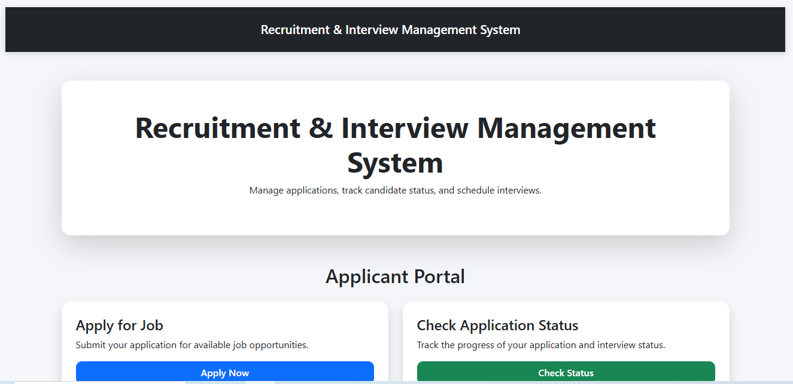
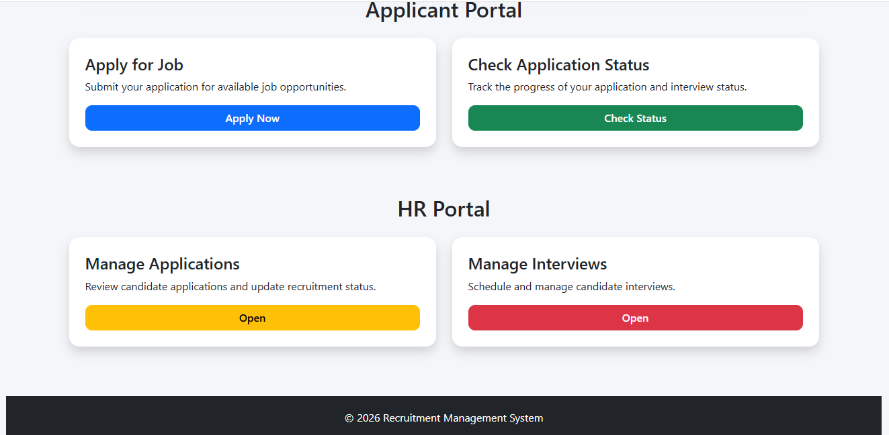
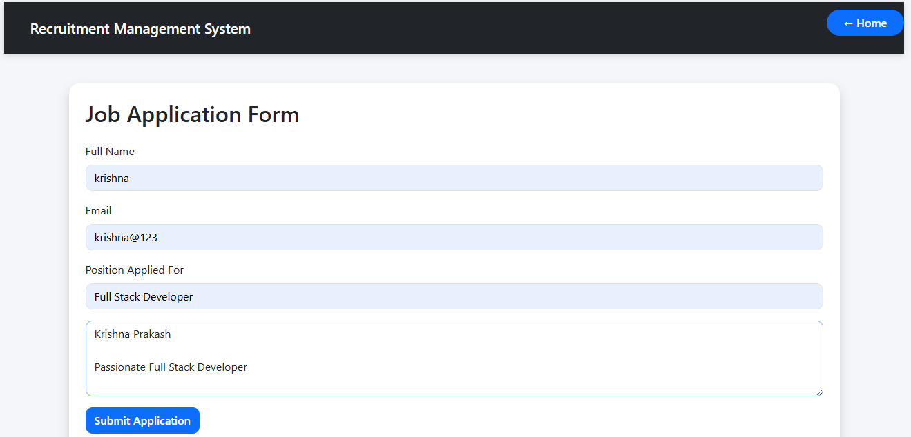
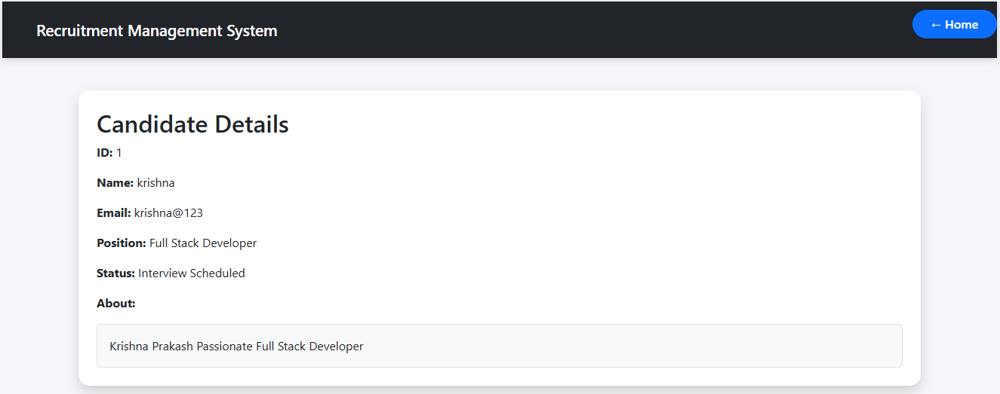
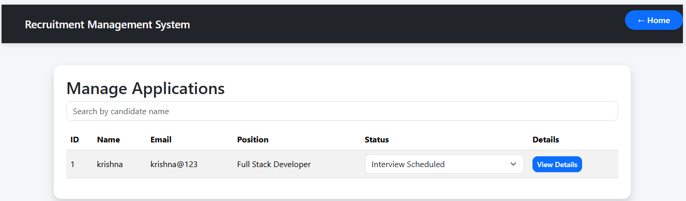
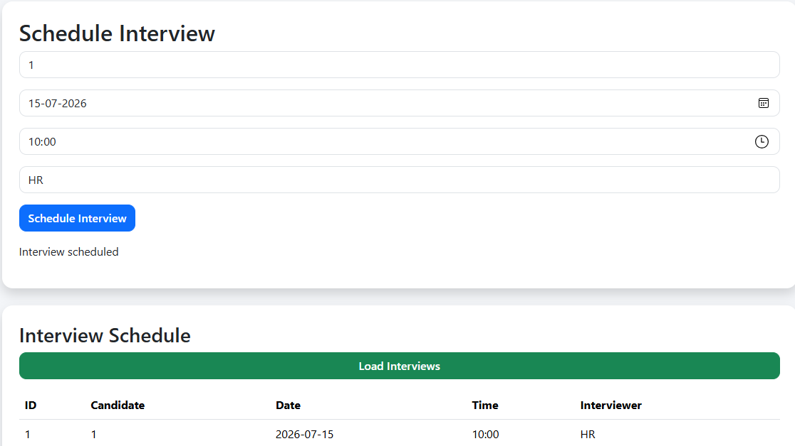
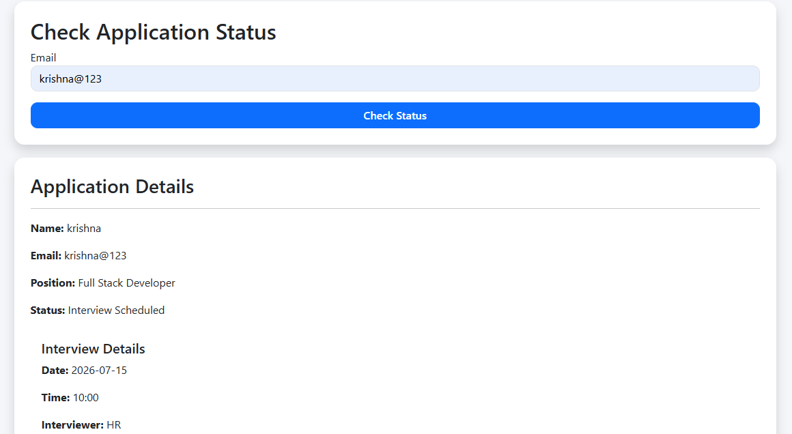

# Recruitment & Interview Management System

A full-stack web application to manage the recruitment process. It allows candidates to apply for jobs, track their status and view interview schedules while HR can manage applications, update candidate status and schedule interviews. This project demonstrates full-stack web development concepts including frontend development, backend API creation, routing, CRUD operations, and data management using Node.js and Express.js.

### Live Demo

https://task-2-krishna-prakash.onrender.com/index.html

⚠️ Note: Since the project is deployed on a free Render instance, it may sometimes take a few seconds to load or respond due to server sleep (cold start).

## Features

### Applicant Portal
- Apply for job positions
- Track application status via email  
- View interview schedules  

### HR Portal
- Manage applications  
- Search and review candidates by name
- View Candidate descriptions  
- Update application status  
- Schedule interviews  

---

## Technologies Used
# Frontend
  - HTML, CSS, Bootstrap  
  - JavaScript (ES6)
# Backend
  - Node.js, Express.js  

---

## Data Storage
   - JSON File Storage
       The application currently uses JavaScript data files for temporary storage
       Data is maintained in memory during server execution, enabling simple CRUD operations without requiring databases.
   # Limitation : 
       Data is reset whenever the server restarts.

## Project Structure
```text
  Recruitment-Interview-Management-System
  │
  ├── applicant
  │   ├── apply.html
  │   ├── apply.js
  │   ├── my_status.html
  │   └── status.js
  │
  ├── hr
  │   ├── applications.html
  │   ├── applications.js
  │   ├── interviews.html
  │   ├── interviews.js
  │   ├── candidate_details.html
  │   └── candidate_details.js
  │
  ├── routes
  │   ├── application.js
  │   └── interview.js
  │
  ├── data
  │   ├── applications.js
  │   └── interviews.js
  │
  ├── index.html
  ├── style.css
  ├── server.js
  ├── package.json
  └── README.md
```

## API Endpoints

### Applications
- POST `/apply` → Submit application  
- GET `/applications` → Get all applications  
- GET `/application-status/:email` → Check status  
- PUT `/applications/:id` → Update status  

### Interviews
- POST `/interviews` → Schedule interview  
- GET `/interviews` → View all interviews  
- GET `/interviews/:candidateId` → Get interview details  

---

## Installation

 ```bash
  git clone <repo-url>
  
  cd Recruitment-Interview-Management-System
  
  npm install
  
  node server.js
  
  http://localhost:5000
```
## Screenshots

### Home Page
        

### Job Application Page


### Candidate Details Page


### HR - Manage Applications


### HR - Schedule Interview


### Candidate Status Page


